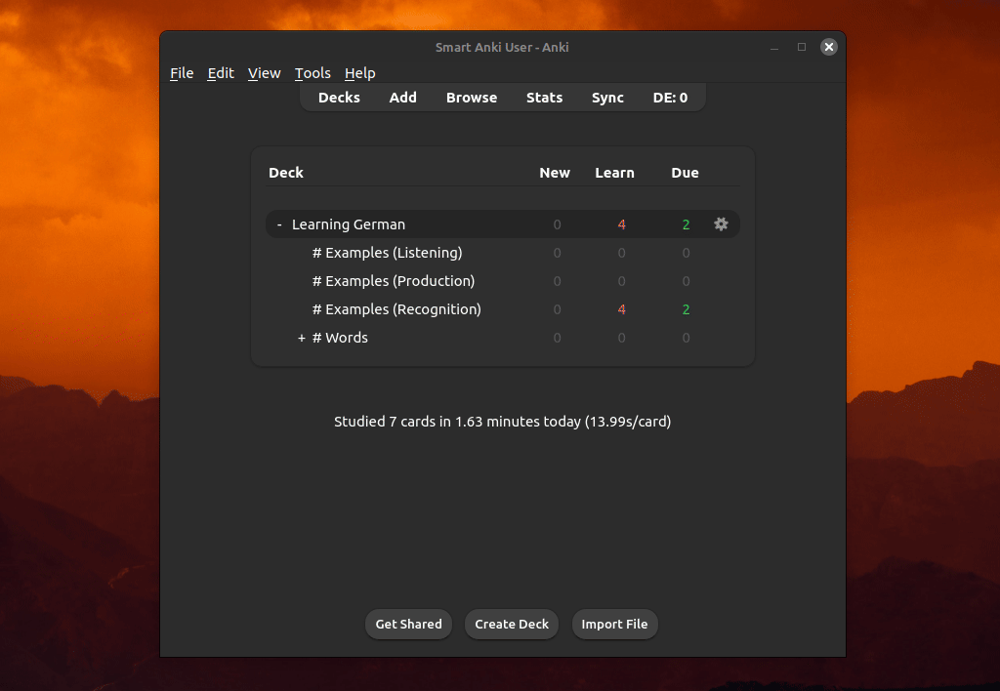
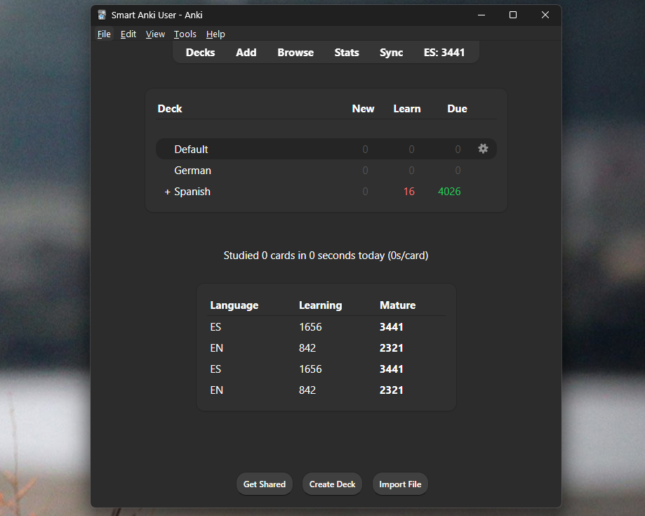

# FrequencyMan (Anki Plugin)

## Overview

FrequencyMan allows you to __sort your new cards__ by word frequency, familiarity, and other useful factors.



## Features
- More than 50 default word frequency lists.
- Define multiple sorting targets for different decks or selection of cards.
- Customize the ranking factors for each target.
- It tracks word familiarity in a non-trivial way, allowing a more accurate sorting by [i+1](https://en.wikipedia.org/wiki/Input_hypothesis#Input_hypothesis).
- Use multiple fields and languages (such as 'front' *and* 'back') to influence the ranking of a card.
- Multiple 'word frequency' lists can be used per language.

## Installation

To download this add-on, please copy and paste the following code into Anki (**Tools > Add-ons > Get Add-ons...**):
__909420026__

## Basic usage

1. Open the "FrequencyMan" menu option in the __"Tools" menu__ of the main Anki window.
2. This will open FrequencyMan's main window where you can define your __sorting targets__.
3. Define the targets using a __JSON array of objects__. Each object represents a target to sort (a target can be a deck or a defined selection of cards).
4. Click the __"Reorder Cards" button__ to apply the sorting.

## Configuration examples

### Example 1
Reorders a single deck. This will only match cards with note type `Basic` located in deck `Spanish`. It will also use the [default ranking factors](#default-ranking-factors).

The content of the cards and all the ranking metrics will be analyzed per '[language](#language-data-id)'. The result of this will be combined to determine the final ranking of all new cards in the defined target.

```json
[
    {
        "deck": "Spanish",
        "notes": [
            {
                "fields": {
                    "Front": "EN",
                    "Back": "ES"
                },
                "name": "Basic"
            }
        ]
    }
]
```


### Example 2
Reorder the same deck twice, but the first target excludes the sorting of cards whose name matches "Speaking", while the second target only sorts those excluded cards.

The first target only modifies a single ranking factor, while the second target reduces the ranking factors used to only 2 factors.

Note: Both targets use the same 'main scope', which is the selection of cards used to create the data to calculate the ranking. This scope is reduced for each target by `reorder_scope_query` to limit which cards get repositioned.

```json
[
    {
        "deck": "Spanish",
        "notes": [
            {
                "fields": {
                    "Meaning": "EN",
                    "Sentence": "ES"
                },
                "name": "Basic (customized note type)"
            }
        ],
        "reorder_scope_query": "-card:*Speaking*",
        "ranking_familiarity": 8
    },
    {
        "deck": "Spanish",
        "notes": [
            {
                "fields": {
                    "Meaning": "EN",
                    "Sentence": "ES"
                },
                "name": "Basic (customized note type)"
            }
        ],
        "reorder_scope_query": "card:*Speaking*",
        "ranking_factors": {
            "familiarity": 1,
            "word_frequency": 1
        }
    }
]
```

### Example #3
Reorder only based on word frequency (using word frequency from both front and back):

```json
[
    {
        "deck": "Spanish::Essential Spanish Vocabulary Top 5000",
        "notes": [
            {
                "name": "Basic-f4e28",
                "fields": {
                    "Front": "ES",
                    "Back": "EN"
                }
            }
        ],
        "ranking_factors": {
            "word_frequency": 1
        }
    }
]
```

## Tokenizers

Custom tokenizers can be defined in `user_files\tokenizers`.

To use a custom tokenizer, or to see how one is defined, you can download [here](https://github.com/Rct567/FrequencyMan_tokenizer_jieba) a working copy of Jieba (ZH), and [here](https://github.com/Rct567/FrequencyMan_tokenizer_janome) a version of Janome (JA).

If you download Janome (JA), you can place it in a directory like `user_files\tokenizers\janome`, which then should contain the file `fm_init_janome.py` and the subdirectory `janome`.

### Automatic support

FrequencyMan will use tokenizers from other plugins, if there is no custom tokenizer for a given language:

- If [ankimorphs-chinese-jieba](https://ankiweb.net/shared/info/1857311956) is installed, Jieba can be used.
- If [ankimorphs-japanese-mecab](https://ankiweb.net/shared/info/1974309724) is installed, Mecab can be used.
- If [AJT Japanese](https://ankiweb.net/shared/info/1344485230) is installed, Mecab can be used.
- If [Morphman](https://ankiweb.net/shared/info/900801631) is installed, Mecab and Jieba can be used (assuming those also work in Morphman itself).

## Ranking factors

### Default ranking factors

```json
"ranking_factors" : {
    "word_frequency": 1.0,
    "internal_word_frequency": 0.0,
    "familiarity": 1.0,
    "familiarity_sweetspot": 0.5,
    "lexical_underexposure": 0.25,
    "ideal_focus_word_count": 4.0,
    "ideal_word_count": 1.0,
    "reinforce_learning_words": 1.5,
    "most_obscure_word": 0.5,
    "lowest_fr_least_familiar_word": 0.25,
    "lowest_word_frequency": 1.0,
    "lowest_internal_word_frequency": 0.0,
    "lowest_familiarity": 1.0,
    "new_words": 0.5,
    "no_new_words": 0.0,
    "ideal_new_word_count": 0.0,
    "proper_introduction": 0.1,
    "proper_introduction_dispersed": 0.0
}
```

### Description

- `word_frequency`: Represents the _word frequency_ of the words in the content, with a bias toward the lowest value. The _word frequency_ values come from the provided _word frequency lists_.
- `internal_word_frequency`: Represents the _word frequency_ of the words based on their occurrence within the notes themselves (the target's content), rather than external frequency lists. Like `word_frequency`, it has a bias toward the lowest value.
- `familiarity`: Represents how familiar you are with the words in the content. Like _word_frequency_, it has a bias toward the lowest value. How familiar you are with a word depends on how many times you have seen the word and in what context that specific word was present (the interval and ease of the card, the amount of words in the content etc.).
- `familiarity_sweetspot`: Promotes cards with words close to a specific 'sweetspot' of familiarity. This can be used to promote cards with words that have already been introduced to you by reviewed cards, but might benefit from 'reinforcement'. These can be recently introduced words, or words that are 'hidden' (non-prominent) in older cards. Use target setting `familiarity_sweetspot_point` to customize the sweetspot value.
- `lexical_underexposure`: Promotes cards with high-frequency words that you are not yet proportionally familiar with. Basically, _lexical_underexposure = (word_frequency-word_familiarity)_.
- `ideal_focus_word_count`: Promotes cards with only a single '_focus word_'. See also _i+1_: https://en.wikipedia.org/wiki/Input_hypothesis#Input_hypothesis. A _focus word_ is a new word or a word you are not yet appropriately familiar with. Use target setting `maturity_threshold` to customize the maximum familiarity of the focus words.
- `ideal_word_count`: Represents how close the _word count_ of the content is to the defined ideal range. By default this is 1 to 5, but you can customize it per target with:
  ```json
  "ideal_word_count": [2, 8]
  ```
- `reinforce_learning_words`: Promotes cards with one or more 'learning' word (a reviewed, but not yet mature word), but only if there are no new words present.
- `most_obscure_word`: Represents the most obscure word. The non-obscurity of a word is defined by either _word_frequency_ or _word_familiarity_ (depending on which is higher, and thus less 'obscure').
- `lowest_fr_least_familiar_word`: Represents the lowest _word frequency_ among the words with the lowest familiarity score.
- `lowest_word_frequency`: Represents the lowest _word frequency_ found in the content of any targeted field. This is different from `word_frequency`, which reflect the average _word frequency_ of all targeted fields.
- `lowest_internal_word_frequency`: Represents the lowest _internal word frequency_ found in the content of any targeted field. This is different from `internal_word_frequency`, which reflects the average _internal word frequency_ of all targeted fields.
- `lowest_familiarity`: Represents the lowest _familiarity_ found in the content of any targeted field. This is different from `familiarity`, which reflect the average _familiarity_ of all targeted fields.
- `new_words`: Promotes cards with one or more new words.
- `no_new_words`: Promotes cards with no new words. Put differently, it promotes cards who's words have all been seen before during review.
- `ideal_new_word_count`: Like `ideal_focus_word_count`, but promotes cards with only a single 'new word' (a word not found in any reviewed card).
- `proper_introduction`: Promotes cards that appear to be well suited to introduce a new word. Various factor are used, including the position of the new word and the word frequency + familiarity of the other words in the content. Cards without new words are not effected.
- `proper_introduction_dispersed`: Disperses cards using the `proper_introduction` factor. This is done per word selected by `lowest_fr_least_familiar_word`, thus dispersing cards with that same word selected. Cards with and without new words are effected.

## Custom fields

The following fields will be automatically populated when you reorder your cards:

- `fm_focus_words`: A list of focus words for each field. (recommended!)
- `fm_new_words`: A list of new words (words not found in reviewed cards) for each field.
- `fm_seen_words`: A list of seen words (words found in reviewed cards) for each field.

Dynamic field names (the number at the end can be replaced with the index number of any field defined in the target):

- `fm_main_focus_word_0`: The focus word with the lowest familiarity for field 0.
- `fm_main_focus_word_static_0`: The focus word with the lowest familiarity for field 0. This field will not be updated once set.
- `fm_lowest_fr_word_0`: The word with the lowest word frequency for field 0.
- `fm_lowest_internal_fr_word_0`: The word with the lowest internal word frequency for field 0.
- `fm_lowest_familiarity_word_0`: The word with the lowest familiarity for field 0.
- `fm_lowest_familiarity_word_static_0`: The word with the lowest familiarity for field 0. This field will not be updated once set.

For debug purposes:

- `fm_debug_info`: Different metrics and data points for each field.
- `fm_debug_ranking_info`: The resulting score per ranking factor for the note.
- `fm_debug_words_info` The score's for each word for 'word frequency', 'lexical underexposure' and 'familiarity sweetspot'.

### Display focus words on the back of your cards (html example)

```html
{{#fm_main_focus_word_0}}
  <p style="color:darkred;">{{fm_main_focus_word_0}}</p>
{{/fm_main_focus_word_0}}

{{#fm_focus_words}}
  <p> <span style="opacity:0.65;">Focus:</span> {{fm_focus_words}} </p>
{{/fm_focus_words}}
```

# Target settings

For each defined target, the following settings are available:

| Setting | Type | Description | Default value      |
|---------|------|-------------|-------|
| `deck`    | string | Name of a single deck as main scope. | -      |
| `decks`   | array of strings | An array of deck names as main scope.  | -      |
| `scope_query`   | string | Search query as main scope.  | -      |
| `notes`   | array of objects |  | -      |
| `reorder_scope_query`   | string | Search query to reduce which cards get repositioned.  | Main scope as defined by `deck`, `decks` or  `scope_query`.       |
| `ranking_factors`   | object |  | see '[Ranking factors](#default-ranking-factors)'      |
| `familiarity_sweetspot_point`   | string \| float | Defines a specific 'sweetspot' of familiarity for  ranking factor `familiarity_sweetspot`.  |   `"~0.5"` (=50% of maturity_threshold)  |
| `suspended_card_value`   | number | The value of suspended reviewed cards for familiarity. |   `0.25`  |
| `suspended_leech_card_value`   | number | The value of suspended reviewed leech cards for familiarity. |   `0.0`  |
| `ideal_word_count`   | array with two int's |  |  `[1, 5]`   |
| `maturity_threshold`   | number | Defined the maximal familiarity value of focus words. Words above this threshold are considered 'mature'.   |  `0.28`   |
| `maturity_min_num_cards`   | number | Minimum number of cards a word must have to be considered 'mature'.   |  `1`   |
| `maturity_min_num_notes`   | number | Minimum number of notes a word must have to be considered 'mature'.   |  `1`   |
| `corpus_segmentation_strategy`   | string | [Corpus data](#target-corpus-data) of a target is joined by _language data id_ by default, but could also stay 'per note field' by setting it to `"by_note_model_id_and_field_name"`.   |  `"by_lang_data_id"`   |
| `id`   | string | Enables [reorder logging](#reorder-logging) for this target. | None, reorder logging is disabled by default.   |

__Notes__:
 - `familiarity_sweetspot_point` accepts a string starting with `~`, such as `"~0.5"`. This can be used to make it relative to the value of `maturity_threshold`. With the default settings, `"~0.5"` would result in a value of `0.14` (50% of 0.28). A string starting with `^` will make the number relative to the median word familiarity value.
 - `suspended_card_value` and `suspended_leech_card_value` are used to devalue reviewed cards that are suspended when calculating 'word familiarity'. This is applied on top of the devaluing that happens if a card is due (devaluing due cards is done with both suspended and non-suspended cards).


# Language data id

For each field a **`language_data_id`** must be defined. In most cases this should just be a two letter language code (ISO 639-1), such as `EN` or `ES`:

```json
[
    {
        "deck": "Spanish::Essential Spanish Vocabulary Top 5000",
        "notes": [
            {
                "name": "Basic-f4e28",
                "fields": {
                    "Spanish": "ES",
                    "English": "EN"
                }
            }
        ]
    }
]
```
Alternatively, a `language_data_id` can also be an 'extended two letter language code':

```json
[
    {
        "deck": "Medical",
        "notes": [
            {
                "name": "Basic-f4e28",
                "fields": {
                    "Front": "EN_MEDICAL",
                    "Back": "EN_MEDICAL"
                }
            },

        ]
    },
]
```

For every **language data id** defined, a directory should exist (although it could be empty). In the example above, `\user_files\lang_data\en_medical` should exist. If it does not exist, you will be prompted to automatically create one with a [default word frequency list](#word-frequency-lists) shipped with FrequencyMan.

Two different types of files can be placed in a **language data id** directory:
- __word frequency lists__: A text or csv file with words sorted to reflect the word frequency (in descending order). Only the position is used, not the (optional) word frequency value.
- __ignore lists__: A text file with words that will not be used to calculate the rankings. The file name should start with "ignore". FrequencyMan comes with a default ignore list ([`ignore_candidates.txt`](https://github.com/Rct567/FrequencyMan/blob/master/default_wf_lists/ignore_candidates.txt)), which can be found in [`default_wf_lists/`](https://github.com/Rct567/FrequencyMan/blob/master/default_wf_lists/). This file contains words most found across different languages (words such as 'FBI', 'Steve', 'cool' etc.).


### Language data folder

In the __language data folder__ itself (`\user_files\lang_data`) the following type of files can be placed:

- __names lists__: A text file with names/words that will not be used to calculate the rankings. The file name should start with "names", such as `names_to_ignore.txt`.
- __ignore lists__: A text file with words that will not be used to calculate the rankings. The file name should start with "ignore".

Both 'name lists' and 'ignore lists' placed in the __language data folder__ itself are used for all languages.

## Reorder logging

Reorder logging is an optional feature that can be enabled by [defining](#target-settings) an `id` on a target. When enabled, information about the content of that target is logged each time the cards are reordered.

### Display the amount of mature words

The information that is logged can be used to display the amount of 'mature' words a target has using the following plugin settings (**Tools > Add-ons > (Select Frequencyman) > Config**):

```json
"show_info_deck_browser": [
    {
        "lang": "ES",
        "target": "*"
    },
    {
        "lang": "EN",
        "target": "*"
    },
    {
        "lang": "ES",
        "target": "id_of_target"
    },
    {
        "lang": "EN",
        "target": "id_of_target"
    }
],
"show_info_toolbar": [
    {
        "lang": "ES",
        "target": "*"
    }
]
```



__Notes__:
- `*` is used to show combined information about all logged targets.
- `show_info_deck_browser` wil create a table below the deck browser (below where you normally see "Studied N cards in N minutes today.").
- If there is no target with an `id` defined, nothing will be logged and thus no information will be shown.
- All logged information is stored in the file `user_files\reorder_log.sqlite`.

## FrequencyMan plugin settings

| Setting | Type | Description | Default value      |
|---------|------|-------------|-------|
| `show_info_deck_browser` | array of objects |  |  |
| `show_info_toolbar` | array of objects |  |  |
| `reposition_shift_existing` | boolean | Wether to move cards outside the target, or leave them in place. | True |

__Notes__:
- To add or change any of the settings above, go to __Tools > Add-ons > (Select Frequencyman) > Config__.
- If `reposition_shift_existing` is set to `True`, the cards from the first reordered target will be positioned at the top of your collection.

## Target Corpus data

A '_corpus data set_' contains all the information related the the content of a note that is used to calculate the ranking of a card (such as the "familiarity" of a word).

Every target has one or more 'corpus data' sets, depending on how many fields are defined in the target and how the `corpus_segmentation_strategy` is set.

By default, `corpus_segmentation_strategy` is set to `"by_lang_data_id"`, which means that a _corpus data set_ will be created for every unique `language_data_id`:

```js
{"Front": "EN", "Back": "EN"} // <- A single corpus data set
{"Front": "EN", "Back": "EN", "Extra": "ES"} // <- Two corpus data sets
```

To create separate _corpus data sets_ for each field, you can set `corpus_segmentation_strategy` to `"by_note_model_id_and_field_name"`. This will create a corpus data set for each field in the target:

```js
{"Front": "EN", "Back": "EN"} // <- Two corpus data sets
{"Front": "EN", "Back": "EN", "Extra": "ES"} // <- Three corpus data sets
```

__Notes__:
- Using `"by_note_model_id_and_field_name"` also means that fields from different notes in the same target will not be 'joined' together.
- Using `"by_note_model_id_and_field_name"` can create multiple _corpus data sets_ for the same language, which may not be desirable for language learning purposes.
- Using `"by_lang_data_id"` will join fields from __all notes__ defined within a target if they have the same `language_data_id`.


## Word frequency lists

FrequencyMan comes with 50+ default word frequency lists. These lists are generated using a combination of sources:

- Open Subtitles 2018: https://github.com/Rct567/top-open-subtitles-sentences/tree/frequencyman-edition
- AI generated children's stories: https://github.com/Rct567/wf_lists_lm_childrenstories
- Wortschatz 'News 2022', AnkiMorphs 'priority files': https://mortii.github.io/anki-morphs/user_guide/setup/prioritizing.html
- Google Books n-gram: https://github.com/orgtre/google-books-ngram-frequency

The default word frequency lists can be found in the [`\default_wf_lists`](https://github.com/Rct567/FrequencyMan/tree/master/default_wf_lists). When prompted to create a new _language data directory_ with a default word frequency list, the relevant file will be copied to the new _language data directory_, such as `\user_files\lang_data\en`.

## The `user_files` directory

The `user_files` directory can be found inside Frequencyman's plugin directory, which can be accessed via: **Tools > Add-ons > (Select Frequencyman) > View Files**.

Any files placed in this folder will be preserved when the add-on is upgraded. All other files in the add-on folder are removed on upgrade.

## Manual installation from GitHub

1. Go to the Anki plugin folder, such as `C:\Users\%USERNAME%\AppData\Roaming\Anki2\addons21`.
2. Create a new folder with the name `FrequencyMan`.
3. Make sure you are still in the directory `addons21`.
4. Run: `git clone https://github.com/Rct567/FrequencyMan.git FrequencyMan`
5. Start Anki.


