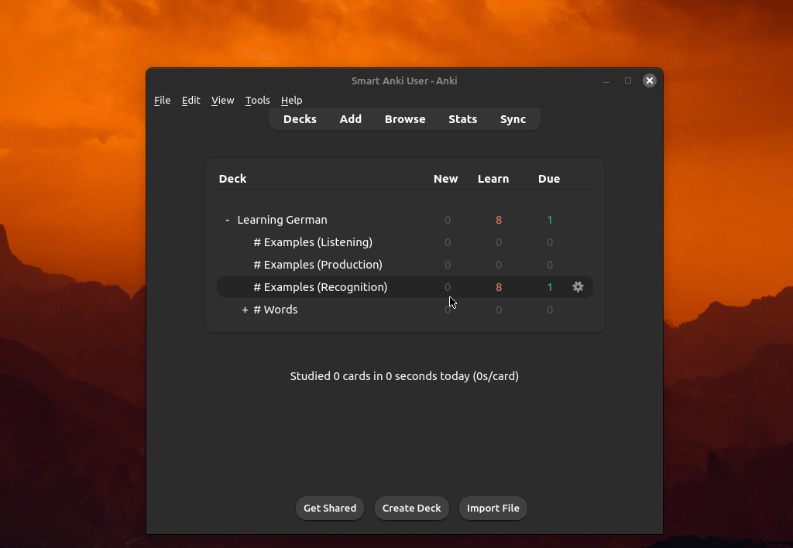

# FrequencyMan (Anki Plugin)

## Overview

FrequencyMan allows you to __sort your new cards__ by word frequency and other useful factors.

Tested on Anki 2.1.60 (Qt6) and 23.12.1 (Qt6).



## Features
- More than 50 default word frequency lists.
- Define multiple sorting targets for different decks or selection of cards.
- Customize the ranking factors for each target.
- Use multiple fields and languages (such as 'front' *and* 'back') to influence the ranking of a card.
- Multiple 'word frequency' lists can be used per language.

## Basic usage

1. Open the "FrequencyMan" menu option in the __"Tools" menu__ of the main Anki window.
2. This will open FrequencyMan's main window where you can define your __sorting targets__.
3. Define the targets using a __JSON array of objects__. Each object represents a target to sort (a target can be a deck or a defined selection of cards).
4. Click the __"Reorder Cards" button__ to apply the sorting.

## Configuration examples

### Example 1
Reorders a single deck. This will only match cards with note type `Basic` located in deck `Spanish`. It will also use the [default ranking factors](#default-ranking-factors).

The content of the cards and all the ranking metrics will be analyzed per '[language](#language-data-id)'. The result of this will be combined to determine the final ranking of all new cards in the defined target.

```json
[
    {
        "deck": "Spanish",
        "notes": [
            {
                "fields": {
                    "Front": "EN",
                    "Back": "ES"
                },
                "name": "Basic"
            }
        ]
    }
]
```


### Example 2
Reorder the same deck twice, but the first target excludes the sorting of cards whose name matches "Speaking", while the second target only sorts those excluded cards.

The first target only modifies a single ranking factor, while the second target reduces the ranking factors used to only 2 factors.

Note: Both targets use the same 'main scope', which is the selection of cards used to create the data to calculate the ranking. This scope is reduced for each target by `reorder_scope_query` to limit which cards get repositioned.

```json
[
    {
        "deck": "Spanish",
        "notes": [
            {
                "fields": {
                    "Meaning": "EN",
                    "Sentence": "ES"
                },
                "name": "Basic (customized note type)"
            }
        ],
        "reorder_scope_query": "-card:*Speaking*",
        "ranking_familiarity": 8
    },
    {
        "deck": "Spanish",
        "notes": [
            {
                "fields": {
                    "Meaning": "EN",
                    "Sentence": "ES"
                },
                "name": "Basic (customized note type)"
            }
        ],
        "reorder_scope_query": "card:*Speaking*",
        "ranking_factors": {
            "familiarity": 1,
            "word_frequency": 1
        }
    }
]
```

### Example #3
Reorder only based on word frequency (using word frequency from both front and back):

```json
[
    {
        "deck": "Spanish::Essential Spanish Vocabulary Top 5000",
        "notes": [
            {
                "name": "Basic-f4e28",
                "fields": {
                    "Front": "ES",
                    "Back": "EN"
                }
            }
        ],
        "ranking_factors": {
            "word_frequency": 1
        }
    }
]
```

## Tokenizers

Custom tokenizers can be defined in `user_files\tokenizers`.

To use a custom tokenizer, or to see how one is defined, you can download [here](https://github.com/Rct567/FrequencyMan_tokenizer_jieba) a working copy of Jieba (ZH), and [here](https://github.com/Rct567/FrequencyMan_tokenizer_janome) a version of Janome (JA).

If you download Janome (JA), you can place it in a directory like `user_files\tokenizers\janome`, which then should contain the file `fm_init_janome.py` and the subdirectory `janome`.

### Automatic support

FrequencyMan will use tokenizers from other plugins, if there is no custom tokenizer for a given language:

- If [ankimorphs-chinese-jieba](https://ankiweb.net/shared/info/1857311956) is installed, Jieba can be used.
- If [ankimorphs-japanese-mecab](https://ankiweb.net/shared/info/1974309724) is installed, Mecab can be used.
- If [AJT Japanese](https://ankiweb.net/shared/info/1344485230) is installed, Mecab can be used.
- If [Morphman](https://ankiweb.net/shared/info/900801631) is installed, Mecab and Jieba can be used (assuming those also work in Morphman itself).

## Ranking factors

### Default ranking factors

```json
"ranking_factors" : {
    "word_frequency": 1.0,
    "familiarity": 2.5,
    "familiarity_sweetspot": 1.0,
    "lexical_underexposure": 0.25,
    "ideal_focus_word_count": 1.0,
    "ideal_word_count": 1.0,
    "reinforce_focus_words": 0.25,
    "most_obscure_word": 0.5,
    "lowest_fr_least_familiar_word": 0.5,
    "lowest_word_frequency": 0.25,
    "lowest_familiarity": 0.25,
    "no_new_words": 0.1,
    "ideal_new_word_count": 0.0,
    "proper_introduction": 0.1,
    "proper_introduction_dispersed": 0.0,
}
```

### Description

- `word_frequency`: Represents the _word frequency_ of the words in the content, with a bias toward the lowest value. The _word frequency_ values come from the provided _word frequency lists_.
- `familiarity`: Represents how familiar you are with the words in the content. Like _word_frequency_, it has a bias toward the lowest value. How familiar you are with a word depends on how many times you have seen the word and in what context that specific word was present (the interval and ease of the card, the amount of words in the content etc).
- `familiarity_sweetspot`: Promotes cards with words close to a specific 'sweetspot' of familiarity. This can be used to promote cards with words that have already been introduced to you by reviewed cards, but might benefit from 'reinforcement'. These can be recently introduced words, or words that are 'hidden' (non-prominent) in older cards. Use target setting `familiarity_sweetspot_point` to customize the sweetspot value.
- `lexical_underexposure`: Promotes cards with high-frequency words that you are not yet proportionally familiar with. Basically, _lexical_underexposure = (word_frequency-word_familiarity)_. Increasing this value means you will be 'pushed' forward more in your language learning journey (and the word frequency list). Increase the value slightly if you experience too much overlap and not enough new words.
- `ideal_focus_word_count`: Promotes cards with only a single '_focus word_'. See also _N+1_: https://en.wikipedia.org/wiki/Input_hypothesis#Input_hypothesis. A _focus word_ is a new word or a word you are not yet appropriately familiar with. Use target setting `focus_words_max_familiarity` to customize the maximum familiarity of the focus words.
- `ideal_word_count`: Represents how close the _word count_ of the content is to the defined ideal range. By default this is 1 to 5, but you can customize it per target with:
  ```json
  "ideal_word_count": [2, 8]
  ```
- `reinforce_focus_words`: Promotes cards with one or more already seen '_focus word_', but only if there are no new words.
- `most_obscure_word`: Represents the most obscure word. The non-obscurity of a word is defined by either _word_frequency_ or _word_familiarity_ (depending on which is higher, and thus less 'obscure').
- `lowest_fr_least_familiar_word`: Represents the lowest _word frequency_ among the words with the lowest familiarity score.
- `lowest_word_frequency`: Represents the lowest _word frequency_ found in the content of any targeted field. This is different from `word_frequency`, which reflect the average _word frequency_ of all targeted fields.
- `lowest_familiarity`: Represents the lowest _familiarity_ found in the content of any targeted field. This is different from `familiarity`, which reflect the average _familiarity_ of all targeted fields.
- `no_new_words`: Promotes cards with no new words. Put differently, it promotes cards who's words have all been seen before during review.
- `ideal_new_word_count`: Like `ideal_focus_word_count`, but promotes cards with only a single 'new word' (a word not found in any reviewed card).
- `proper_introduction`: Promotes cards that appear to be well suited to introduce a new word. Various factor are used, including the position of the new word and the word frequency + familiarity of the other words in the content. Cards without new words are not effected.
- 'proper_introduction_dispersed': Disperses cards using the 'proper introduction' factor. This is done per new word, thus dispersing cards with the same new word.

## Custom fields

The following fields will be automatically populated when you reorder your cards:

- `fm_focus_words`: A list of focus words for each field. (recommended!)
- `fm_new_words`: A list of new words (words not found in reviewed cards) for each field.
- `fm_seen_words`: A list of seen words (words found in reviewed cards) for each field.

Dynamic field names (the number at the end can be replaced with the index number of any field defined in the target):

- `fm_main_focus_word_0`: The focus word with the lowest familiarity for field 0.
- `fm_main_focus_word_static_0`: The focus word with the lowest familiarity for field 0. This field will not be updated once set.
- `fm_lowest_fr_word_0`: The word with the lowest word frequency for field 0.
- `fm_lowest_familiarity_word_0`: The word with the lowest familiarity for field 0.
- `fm_lowest_familiarity_word_static_0`: The word with the lowest familiarity for field 0. This field will not be updated once set.

For debug purposes:

- `fm_debug_info`: Different metrics and data points for each field.
- `fm_debug_ranking_info`: The resulting score per ranking factor for the note.
- `fm_debug_words_info` The score's for each word for 'word frequency', 'lexical underexposure' and 'familiarity sweetspot'.

### Display focus words on the back of your cards (html example)

```html
{{#fm_focus_words}}
  <p> <span style="opacity:0.65;">Focus:</span> {{fm_focus_words}} </p>
{{/fm_focus_words}}
```

# Target settings

For each defined target, the following setting are available:

| Setting | Type | Description | Default value      |
|---------|------|-------------|-------|
| `deck`    | string | Name of a single deck as main scope. | -      |
| `decks`   | array of strings | An array of deck names as main scope.  | -      |
| `scope_query`   | string | Search query as main scope.  | -      |
| `notes`   | array of objects |  | -      |
| `reorder_scope_query`   | string | Search query to reduce which cards get repositioned.  | Main scope as defined by `deck`, `decks` or  `scope_query`.       |
| `ranking_factors`   | object |  | see '[Ranking factors](#default-ranking-factors)'      |
| `familiarity_sweetspot_point`   | string \| float | Defines a specific 'sweetspot' of familiarity for  ranking factor `familiarity_sweetspot`.  |   `"~0.5"` (=50% of focus_words_max_familiarity)  |
| `suspended_card_value`   | float |  |   `0.1`  |
| `suspended_leech_card_value`   | float |  |   `0.0`  |
| `ideal_word_count`   | array with two int's |  |  `[1, 5]`   |
| `focus_words_max_familiarity`   | float |  |  `0.28`   |
| `corpus_segmentation_strategy`   | string | [Corpus data](#target-corpus-data) is joined by _language data id_ by default, but could also stay 'per note field' by setting it to `"by_note_model_id_and_field_name"`.   |  `"by_lang_data_id"`   |

__Notes__:
 - `familiarity_sweetspot_point` accepts a string starting with `~`, such as `"~0.5"`. This can be used to make it relative to the value of `focus_words_max_familiarity` value. In this case `"~0.5"` would result in a value of `0.14`. A string starting with `^` will make the number relative to the median word familiarity value.

# Language data id

For each field a **`language_data_id`** must be defined. In most cases this should just be a two letter language code (ISO 639-1), such as `EN` or `ES`:

```json
[
    {
        "deck": "Spanish::Essential Spanish Vocabulary Top 5000",
        "notes": [
            {
                "name": "Basic-f4e28",
                "fields": {
                    "Spanish": "ES",
                    "English": "EN"
                }
            }
        ]
    }
]
```
Alternatively, a `language_data_id` can also be an 'extended two letter language code':

```json
[
    {
        "deck": "Medical",
        "notes": [
            {
                "name": "Basic-f4e28",
                "fields": {
                    "Front": "EN_MEDICAL",
                    "Back": "EN_MEDICAL"
                }
            },

        ]
    },
]
```

For every **language data id** defined, a directory should exist (although it could be empty). In the example above, `\user_files\lang_data\en_medical` should exist. If it does not exist, you will be prompted to automatically create one with a default word frequency file shipped with FrequencyMan.

Two different types of files can be placed in a **language data id** directory:
- __word frequency lists__: A text or csv file with words sorted to reflect the word frequency (in descending order). Only the position is used, not the (optional) word frequency value.
- __ignore lists__: A text file with words that will not be used to calculate the rankings. The file name should start with "ignore".

## Target Corpus data

A '_corpus data set_' contains all the information related the the content of a note that is used to calculate the ranking of a card (such as the "familiarity" of a word).

Every target has one or more 'corpus data' sets, depending on how many fields are defined in the target and how the `corpus_segmentation_strategy` is set.

By default, `corpus_segmentation_strategy` is set to `"by_lang_data_id"`, which means that a _corpus data set_ will be created for every unique `language_data_id`:

```js
{"Front": "EN", "Back": "EN"} // <- A single corpus data set
{"Front": "EN", "Back": "EN", "Extra": "ES"} // <- Two corpus data sets
```

To create separate _corpus data sets_ for each field, you can set `corpus_segmentation_strategy` to `"by_note_model_id_and_field_name"`. This will create a corpus data set for each field in the target:

```js
{"Front": "EN", "Back": "EN"} // <- Two corpus data sets
{"Front": "EN", "Back": "EN", "Extra": "ES"} // <- Three corpus data sets
```

Things to note:
- Using `"by_note_model_id_and_field_name"` also means that fields from different notes in the same target will not be 'joined' together.
- Using `"by_note_model_id_and_field_name"` can create multiple _corpus data sets_ for the same language, which may not be desirable for language learning purposes.
- Using `"by_lang_data_id"` will join fields from __all notes__ defined within a target if they have the same `language_data_id`.


## Word frequency lists

FrequencyMan comes with 50+ default word frequency lists. These are generated using one of the following sources:

- Google Books n-gram: https://github.com/orgtre/google-books-ngram-frequency
- Based on Open Subtitles: https://github.com/hermitdave/FrequencyWords/tree/master

The default word frequency lists can be found in the `\default_wf_lists`. When prompted to create a new _language data directory_ with a default word frequency list, the relevant file will be copied to the new _language data directory_, such as `\user_files\lang_data\en`.

## The `user_files` directory

The `user_files` directory can be found inside Frequencyman's plugin directory, which can be accessed via: **Tools > Add-ons > (Select Frequencyman) > View Files**.

Any files placed in this folder will be preserved when the add-on is upgraded. All other files in the add-on folder are removed on upgrade.

## Manual installation from GitHub

1. Go to the Anki plugin folder, such as `C:\Users\%USERNAME%\AppData\Roaming\Anki2\addons21`.
2. Create a new folder with the name `FrequencyMan`.
3. Make sure you are still in the directory `addons21`.
4. Run: `git clone https://github.com/Rct567/FrequencyMan.git FrequencyMan`
5. Start Anki.


